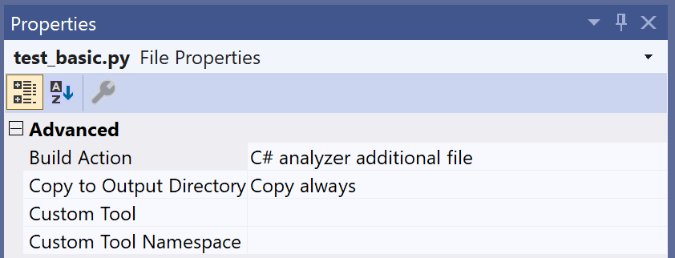

# Getting Started

To get started with CSnakes, you need to:

* [Install Python](#installing-python)
* [Put your Python files into a C# Project](#configuring-a-c-project-for-csnakes)
* [Use type annotations for the functions you want to call from C#](#using-type-annotations-for-reflection)
* [Install the `CSnakes` and `CSnakes.Runtime` packages into the project](#installing-the-nuget-packages-for-csnakes)
* [Mark them for source generation](#marking-files-for-generation)
* [Install the `CSnakes.Runtime` nuget package in the C# Project you want to execute the Python code from](#building-the-project)
* [Setup a Virtual Environment (Optional)](#using-virtual-environments)
* [Instantiate a Python environment in C# and run the Python function](#calling-csnakes-code-from-cnet)

## Installing Python

Because CSnakes embeds Python in your .NET project, you need to have Python installed on your machine. CSnakes supports Python 3.9-3.13.

Embedding Python is a bit different to running `python` on the command line, because it requires 3 paths, instead of just one (`python`):

1. The path to the Python library, sometimes called `python3.dll` or `libpython3.so`.
2. The path to the Python standard library, which is a directory containing the Python standard library.
3. The path to your Python code

And, optionally, a path to a virtual environment if you have one.

To make this easier, we've bundled [Python Locators](reference.md#python-locators) as extension methods to the environment builder with common installation paths for Python.

## Configuring a C# Project for CSnakes

To setup a C# project for CSnakes, you need to:

1. Create a new C# project or open an existing one.
2. Add your Python files to the project.
3. Mark the Python files as "Additional Files" in the project file.
4. Install the `CSnakes` and `CSnakes.Runtime` NuGet packages.
5. Create a `PythonEnvironment` in C# and create an instance of the Python module.
6. Call any Python code. 

### Installing the NuGet packages

CSnakes has two nuget packages that you need to install in your C# project:

1. [`CSnakes`](https://www.nuget.org/packages/CSnakes/) - the source generator that will create the C# classes from your Python files. Install this in the project that contains the Python files.
2. [`CSnakes.Runtime`](https://www.nuget.org/packages/CSnakes.Runtime/) - the runtime that will execute the Python code. Install this in the project that will call the Python code.

If you are using one project for both the Python code and the C# code, you can install both packages in the same project.

## Adding Python files

CSnakes uses the Python type annotations to generate C# code. You need to add Python files to your project and add type annotations to the functions you want to call from C#.

For example, if you were to create a Python file called `demo.py` to your project with the following content: 

```python
def hello_world(name: str) -> str:
    return f"Hello, {name}!"
```

See the [reference supported types](reference.md#supported-types) for a list of Python types and their C#.NET equivalents.

## Marking files for generation

For CSnakes to run the source generator over Python files, you need to mark the Python file as an "Additional File" in the CSProj file XML:

```xml
    <ItemGroup>
        <AdditionalFiles Include="demo.py">
            <CopyToOutputDirectory>Always</CopyToOutputDirectory>
        </AdditionalFiles>
```

Or, in Visual Studio change the properties of the file and set **Build Action** to **Csharp analyzer additional file**.



## Building the project

After you've added the Python files to the project, installed the NuGet packages, and marked the Python files for generation, you can build the project using `dotnet build`.

## Constructing a Python environment from C#

Python environments created by CSnakes are designed to be process-level singletons. This means that you can create a Python environment once and use it throughout the lifetime of the process.

CSnakes comes with a host builder for the `Microsoft.Extensions.Hosting` library to make it easier to create a Python environment in your C# code.

CSnakes also needs to know where to find Python using one or many [Python Locators](reference.md#python-locators). This example uses the [NuGet locator](reference.md#nuget-locator), which is an easy way to get started on Windows.

Here's an example of how you can create a Python environment in C#:

```csharp
using CSnakes.Runtime;
using Microsoft.Extensions.DependencyInjection;
using Microsoft.Extensions.Hosting;
using System;
using System.Collections.Generic;
using System.IO;
using System.Text.Json;

var builder = Host.CreateDefaultBuilder(args)
    .ConfigureServices(services =>
    {
        var home = Path.Join(Environment.CurrentDirectory, "."); /* Path to your Python modules */
        services
        .WithPython()
        .WithHome(home)
        .FromNuGet("3.12.4"); // Add one or many Python Locators here
    });

var app = builder.Build();

var env = app.Services.GetRequiredService<IPythonEnvironment>();
```

Check out the sample project in the [samples](https://github.com/tonybaloney/CSnakes/tree/main/samples) for code examples of a .NET console application and web application.

## Using Virtual Environments

Since most Python projects require external dependencies outside of the Python standard library, CSnakes supports execution within a Python virtual environment.

Use the `.WithVirtualEnvironment` method to specify the path to the virtual environment.

You can also optionally use the `.WithPipInstaller()` method to install packages listed in a `requirements.txt` file in the virtual environment. If you don't use this method, you need to install the packages manually before running the application.

```csharp
...
services
    .WithPython()
    .WithVirtualEnvironment(Path.Join(home, ".venv"))
    // Python locators
    .WithPipInstaller(); // Optional - installs packages listed in requirements.txt on startup
```

## Calling CSnakes code from C#.NET

Once you have a Python environment, you can call any Python function from C# using the `IPythonEnvironment` interface.

Here's an example of how you can call the `hello_world` function from the `demo.py` file:

```csharp
var env = app.Services.GetRequiredService<IPythonEnvironment>();

var module = env.Demo();

var result = module.HelloWorld("Alice");
Console.WriteLine(result); // Hello, Alice!
```

Check out the [reference](reference.md) for more information on supported types and features.
